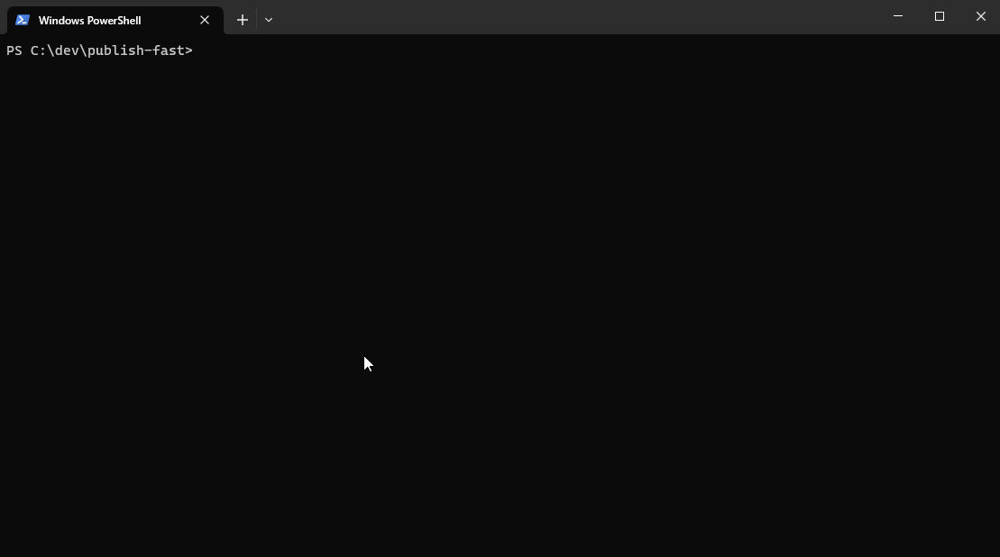

# Publish Fast

> A straight forward tool for streamlining the publishing of NPM packages without a lot of setup and work

This project is inspired by [np](https://github.com/sindresorhus/np), and pretty much does the same thing,
except that publish-fast is suitable to run in CI, directly creates a github release from a local template
instead of just drafting one, supports uploading release assets, automatically updates a changelog file
and supports config files. It thus does more stuff automatically without much manual effort, and is more 
suitable to run in automated workflows.

## Features

- Automatically bumps version, creates a commit, creates a tag, and pushes it to the remote
- A list of scripts to be run before the release can be provided (e.g. "lint,test")
- Supports npm, yarn and pnpm
- Automatically checks that the user is on the correct branch before releasing
- Automatically checks that the working directory is clean before releasing
- Loads release notes from a local file, and clears that file after publishing to an empty file or a predefined template
- Can update a local changelog file with release notes
- Can create a github release with release notes
- Can upload assets to the github release defined by a glob option
- Dry Run mode
- Almost all steps can be skipped
- Options can be passed in through a `.publishrc.json` file or the `publish` property in a `package.json` file

## Release Notes Workflow

This tool supports to automatically read release notes to be used in the changelog and github release.
Create a file in your repo, e.g. `release-notes.md`. There, every time you add new changes to your project,
document the changes you made in that file.

When running `publish-fast` to create a new release, use the option `--release-notes-source release-notes.md`.
Remember that you can create a script alias in your package.json for the release script, so you don't need to
pass that every time. The release notes will be read from that file, and then the file will be cleared to an empty
file.

You can also define a template to which the release notes will be reset after the release instead of clearing it.
Use the option `--release-notes-template release-notes-template.md` to do that.

## Github Token

If uploading a github release is enabled, the tool needs a valid Github Auth token. If you run the tool on your
dev machine, the easiest way is to install the [gh cli](https://cli.github.com/) and run `gh auth login` to
create a token. Then, the tool will automatically use that token.

If you do not want to install the Github CLI, you can pass the token via the `--github-token` option. Alternatively,
the tool will interactively ask for the token when run.

## How to use

You can install `publish-fast` as dependency to your project, 

    npm install publish-fast

and then add a script to your `package.json`:

    "scripts": {
      "release": "publish-fast patch"
    }

Then you can run `yarn release` or `npm run release` to publish a new version.

You can also install it globally via

    npm install -g publish-fast

or directly use via

    npx publish-fast

Usage:
    Usage: publish-fast [options] [bump]
    
    Options:
      -V, --version                                      output the version number
      --verbose                                          verbose output (default: false)
      --dry-run                                          dry run (default: false)
      --package-manager <package-manager>                package manager, detected from lock file by default (default: "auto")                                                                      
      --pre-scripts <pre-scripts>                        pre scripts seperated by commas (e.g. lint,test) (default: "lint,test")
      --commit-message <commit-message>                  new version commit message (default: "chore(release): {version}")
      --commit-author <commit-author>                    new version commit author                                                                                                                  
      --commit-email <commit-email>                      new version commit email
      --branch <branch>                                  release branch, for verification (default: "main")
      --release-notes-source <release-notes-source>      path to release notes source markdown file. Leave empty to use empty release notes.                                                        
      --release-notes-template <release-notes-template>  path to release notes template markdown file. Leave empty to not recreate the file after publishing.
      --changelog <changelog>                            path to changelog file. Leave empty to not update changelog. Will automatically be skipped if file doesn't exist. (default: "CHANGELOG.md")
      --github-token <github-token>                      github token for creating github release. If not provided, CLI will attempt to load through gh CLI, or alternatively interactively ask.    
      --draft-release                                    create github release as draft (default: false)
      --npm-tag <npm-tag>                                npm tag to publish to (default: "latest")
      --npm-access <npm-access>                          npm access level                                                                                                                           
      --otp <npm-otp>                                    npm otp code                                                                                                                               
      --release-assets <glob>                            glob for release assets to upload to the github release
      --pipe-stdout                                      pipe stdout of child processes through (default: false)
      --skip-install                                     skip installing dependencies (default: false)
      --skip-github-release                              skip creating github release (default: false)
      --skip-publish                                     skip publishing to npm (default: false)
      --skip-bump                                        skip bumping version (default: false)
      --skip-push                                        skip pushing changes (default: false)
      --skip-commit                                      skip committing changes (default: false)
      -h, --help                                         display help for command

You can also pass in options through a `.publishrc.json` file or the `publish` property in a `package.json` file.
Note that all options, which are snake-case in the CLI, are camelCase in the config file, i.e. the `--release-notes-source`
option becomes `releaseNotesSource` in the config file.

## Dry Run Demo

## How to develop

- `yarn` to install dependencies
- `yarn start` to run in dev mode
- `yarn test` to run tests
- `yarn lint` to test and fix linter errors

To publish a new version, run `yarn release`.
